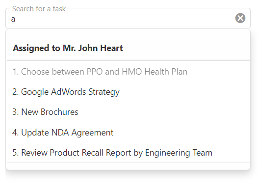

<!-- default badges list -->

<!-- default badges end -->
# DevExtreme Autocomplete - Getting Started

This repository stores the code examples of the Autocomplete component for the [Getting Started with Autocomplete](https://js.devexpress.com/Documentation/Guide/UI_Components/Autocomplete/Getting_Started_with_Autocomplete/) tutorial. This tutorial explains how to add an Autocomplete to a page, group Autocomplete data, configure search settings, and customize field and each item appearances.

## Files to Review

- **Angular**
    - [app.component.html](angular/src/app/app.component.html)
    - [app.component.ts](angular/src/app/app.component.ts)
- **jQuery**
    - [index.js](jquery/src/index.js)
- **React**
    - [App.js](react/src/App.js)
- **Vue**
    - [App.vue](vue/src/App.vue)

## Documentation

- [Getting Started with Autocomplete](https://js.devexpress.com/Documentation/Guide/UI_Components/Autocomplete/Getting_Started_with_Autocomplete/)

- [Autocomplete - API Reference](https://js.devexpress.com/Documentation/ApiReference/UI_Components/dxAutocomplete/)
